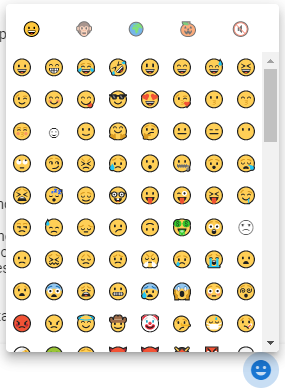
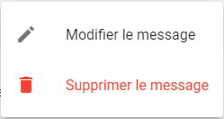

## Envoyer un message

1. **Écrire son message**
Dans la zone de texte, on peut y écrire le message que l’on veut envoyer

2. **Ajouté des émojis (facultatif)**
Il y a la possibilité d’ajouter des émojis dans son message, pour ça il suffit de cliquer sur le bouton émoji  ce qui va ouvrir le menu d’émojis

Après il suffit de cliquer sur l’émoji que l’on veut ajouter a son message
3. **Envoyer le message**
Pour ça il y a deux possibilités :
    - Cliquer sur le bouton “envoyer” 
    - Appuyer sur la touche entrée de son clavier 

## Liste des messages
1. Accéder aux options d’un message
Survoler son message avec sa souris, le fond de celui-ci vas s'assombrir et un bouton vas apparaitre à droite de celui-ci, cliquer sur le bouton 
2. Menu de gestion

    - Modifier le message
        - Le texte du message va être remplacé par une zone de texte permettant d’éditer le message par le nouveau message
        
    - Supprimer le message