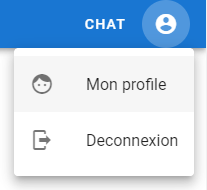
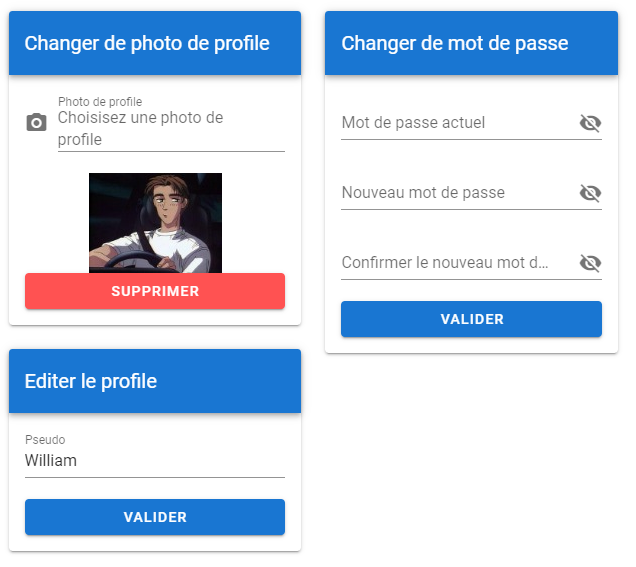
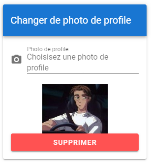
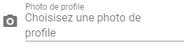
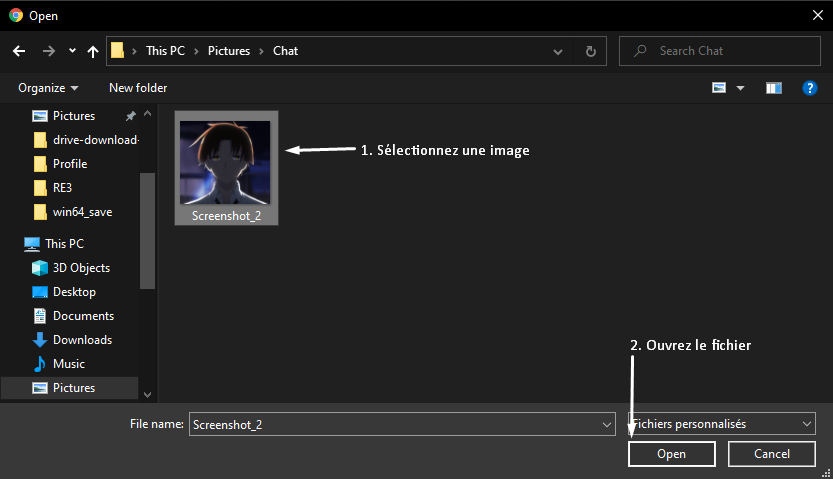
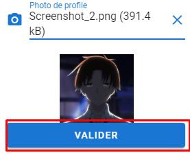
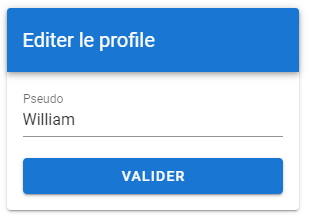
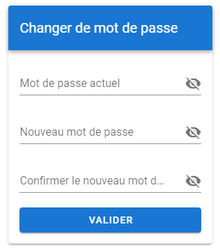

Pour accéder aux paramètres de son profile, il suffit de cliquer sur le logo utilisateur et de sélectionner “Mon profil”

### Changer de photo de profil

1. Cliquer le champ

2. Sélection de l’image
    1. Sélectionnez une image
    2. Ouvrez l’image
    
3. Cliquez sur valider

### Éditer le profile
Changez le contenu du champ de texte puis cliquez sur le bouton valider.

### Changer de mot de passe
1. Entrer votre mot de passe actuel
2. Votre nouveau mot de passe
3. Confirmez le nouveau mot de passe

