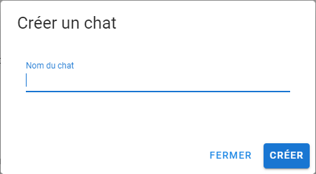
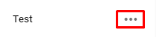
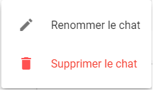

## Créer un chat
1.  **Ouvrir la fenêtre de création de chat**
Pour ouvrir la page de création d’un chat il suffit de cliquer sur le bouton 
2.  **Nommer le chat**
Donner un nom au chat et cliquer sur 

## Gestion d’un chat
1. **Accéder aux options du chat**
À côté du nom du chat on peut voir 3 petits points, cliquez dessus 
2. **Menu de gestion** 
Il y a plusieurs possibilités
    - **Menu propriétaire**
    
        - Renommer le chat
        - Supprimer le chat
    - **Menu invité**
    