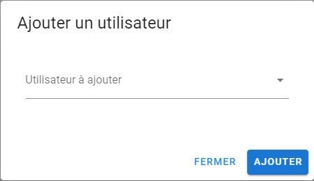

## Informations
>Dans la liste des utilisateurs on peut voir les utilisateurs qui on accès au chat.
Chaque utilisateur a un avatar avec un indicateur de status :
>- Connecté
>- Déconnecté

## Invité un utilisateur dans son chat
!> Seul le propriétaire du chat peu ajouter une personne a son chat.
- **Ouvrir la fenêtre d’ajout d’utilisateurs**
Pour ouvrir la page d’ajout d’utilisateur il suffit de cliquer sur le bouton 
- **Sélection des utilisateurs à ajouter**
Sélectionnez les utilisateurs que vous voulez ajouter et cliquer sur 

## Interactions avec les autres utilisateurs
Pour interagir avec les utilisateurs il suffit de cliquer sur le bouton à droite du nom de l'utilisateur
Cela ouvre un menu avec différentes options selon si vous être le **propriétaire** du chat ou bien **invité**
- **Propriétaire**

- **Invité**

Les deux ont en communs le fait de pouvoir envoyer un message privé a un utilisateur, mais il n’y a que le propriétaire qui puisse exclure une personne de son chat.
