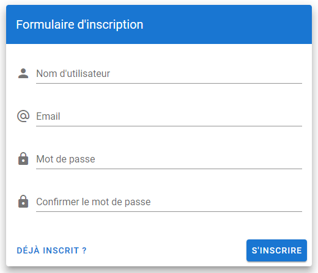

Pour s’inscrire il vous faudra fournir :
- Un nom d’utilisateur, qui sera utilisé comme pseudonyme sur le tchat
- Une adresse mail, qui sera utilisé pour l'authentification
- Un mot de passe, de minimum 6 caractères

